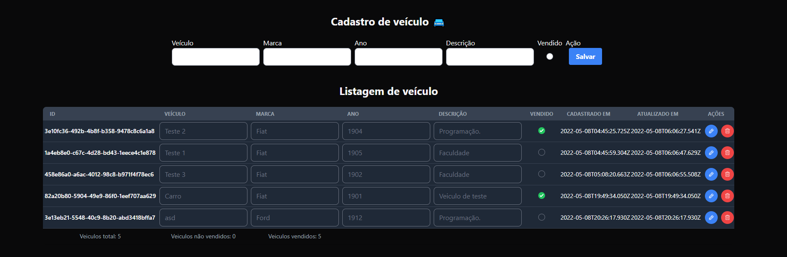

# Avaliação para vaga dev na Tinnova.

Avaliação com 5 desafios em nodejs, sendo o quinto desafio com front-end.

Do primeiro ao quarto desafio eu fiz usando Nodejs com Typescript.
O quinto desafio no back-end, fiz usando Express, Prisma e SQLite por ser mais pratico e por ser um teste que vai rodar apenas em local.
Fazia um tempo que queria testar o prisma e aproveitei este momento pra isso (então foi mais um desafio extra :D, e que por sinal achei muito massa o Prisma).
No lado do front-end usei o React (Vite) que o qual tenho um pouco de noção e qua já estudei um pouco (confesso que não está nada bonito).
No geral foi bem divertido faze-los, mesmo que não esteja como o esperado.

## Instalação

Depois de clonar o projeto.

Abra a pasta "primeiro_ao_quarto" e rode o comando:

`npm install`

Os comandos do desafio são os seguintes:

`npm run primeiro_desafio`

`npm run segundo_desafio`

`npm run terceiro_desafio`

`npm run quarto_desafio`

O quinto desafio foi separo em duas pasta sendo um para o back e outra para o front.

Começamos a configurar o back.

Primeiro abra a pasta "quinto_desafio_back";
Faça uma cópia do arquivo .env.example para .env;
No .env não precisa mexer em nada (já está configurado)
Então rodamos o comando `npm install` para instalar as dependencias;
Depois de instalado rodamos o `npm run dev` o servidor;
Não precisa configurar banco pois o arquivo do sqlite já está na pasta do prisma.
Para visualizar o banco basta rodar o comando (em outra janela do console) `npx prisma studio`;
Para testar as rotas, basta importar o .json do insommnia.

Agora vamos para o front.

Vá até a pasta "quinto_desafio_front";
Rode o comando `npm install`;
Em seguida rodar o comando `npm run dev`;
Acessar o `localhost:3000` e prontinho :D.